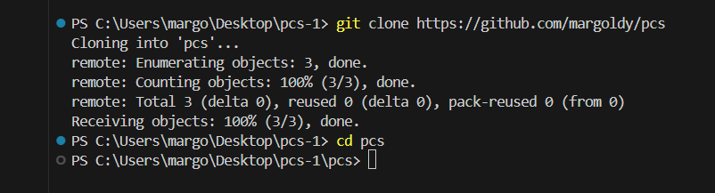
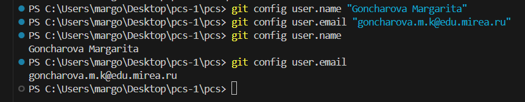
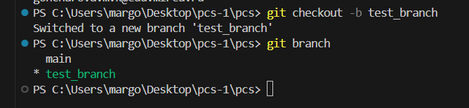
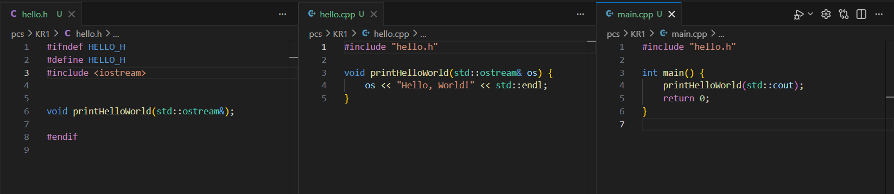
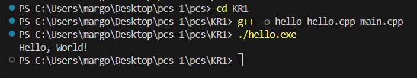
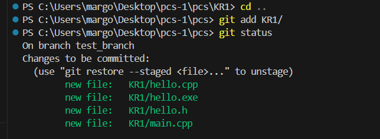
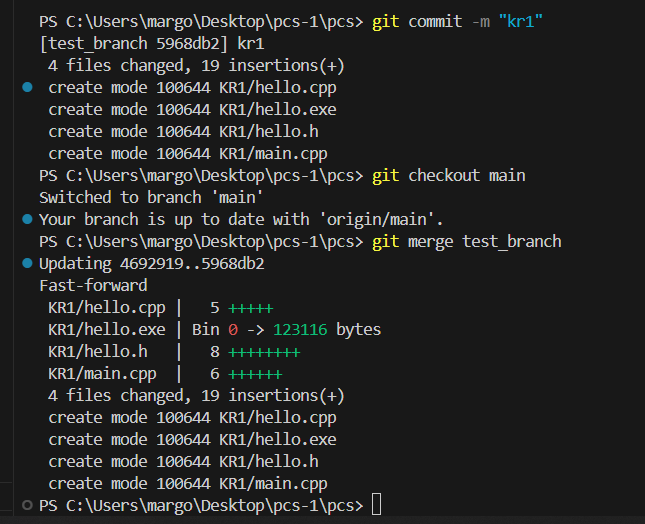
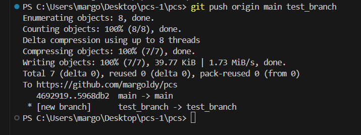

# ПКС: Контрольная №1

## Отчёт о выполнении

### Связь с репозиторием

### Настройка имени и почты

### Создание ветки и переключение

### Скриншот трех созданных файлов

### Сборка и запуск

### Коммит и слияние

### Отправка на репозиторий

